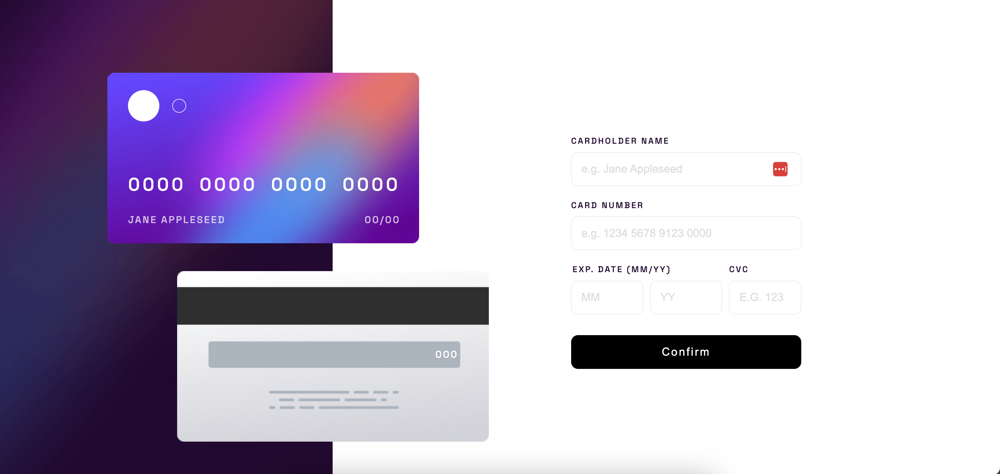

# Frontend Mentor - Interactive card details form solution

This is a solution to the [Interactive card details form challenge on Frontend Mentor](https://www.frontendmentor.io/challenges/interactive-card-details-form-XpS8cKZDWw). Frontend Mentor challenges help you improve your coding skills by building realistic projects. 

## Table of contents

- [Overview](#overview)
  - [The challenge](#the-challenge)
  - [Screenshot](#screenshot)
  - [Links](#links)
- [My process](#my-process)
  - [Built with](#built-with)
  - [What I learned](#what-i-learned)
  - [Continued development](#continued-development)
  - [Useful resources](#useful-resources)
- [Author](#author)

## Overview

### The challenge

Users should be able to:

- Fill in the form and see the card details update in real-time
- Receive error messages when the form is submitted if:
  - Any input field is empty
  - The card number, expiry date, or CVC fields are in the wrong format
- View the optimal layout depending on their device's screen size
- See hover, active, and focus states for interactive elements on the page

### Screenshot

### Links

- Solution URL: [Add solution URL here](https://your-solution-url.com)
- Live Site URL: [Add live site URL here](https://your-live-site-url.com)

## My process

### Built with

- HTML5
- CSS
- Vanilla Javascript
I picked these technologies as I don't feel the need to use fancier frameworks/libraries.

### What I learned

Explored more of Javascript - converted initial JS code to more modern ES6 format.
Explored more of CSS3 that works on most modern browsers - updated to the use of calc() in getting rem and em sizing to replace older 62.5% HTML trick, use of custom properties.
Review and deep dive into event driven programming.
Exercised on refactoring code. Sure the code can further be optimized, but it is also part of the exercise when to stop and just deliver the code out there.
It's too easy to write bad code in JavaScript if you have not experienced writing in other typed languages. Typescript could be great alternative to avoid such issues.

### Continued development

My current focus is mainly developing web applications using Angular which I am doing professionally, though I have plans to learn React if I have time. I'm doing the challenges to continuously update myself.

### Useful resources

- [CSS Grid | CSS Tricks](https://css-tricks.com/snippets/css/complete-guide-grid/) - Handy reference and guide I have bookmarked.
- [CSS Flexbox | CSS Tricks](https://css-tricks.com/snippets/css/a-guide-to-flexbox/) - Handy reference and guide like the above link.
- [CSS Custom Properties | CSS Tricks](https://css-tricks.com/a-complete-guide-to-custom-properties/) - Have to think less of SASS and tried out this one. It's easier to read and spot the double dash variables!
- [Refactoring HTML and CSS | 1WD](https://1stwebdesigner.com/refactoring-html-and-css/) - I didn't use most of the techniques most especially the comments and decided to split the CSS into several files instead. I just prefer to write more code that speaks what it does than updating the comments that go along with it.
- [Caniuse](https://caniuse.com/) - Must bookmark. Handy tool for checking cross browser compatibility so you don't have to manually check every browser every time before you use them in code.
- [Regular Expressions](https://regex101.com/) - Must bookmark. Handy tool for writing regular expressions.
- [JavaScript String Methods | W3Schools](https://www.w3schools.com/js/js_string_methods.asp) - Still relevant and updated, what I like best about the site is that I can try out the simple examples and modify them.

## Author

- Frontend Mentor - [Gem](https://www.frontendmentor.io/profile/ladyprogrammer)

